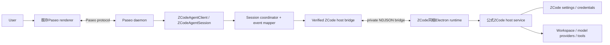
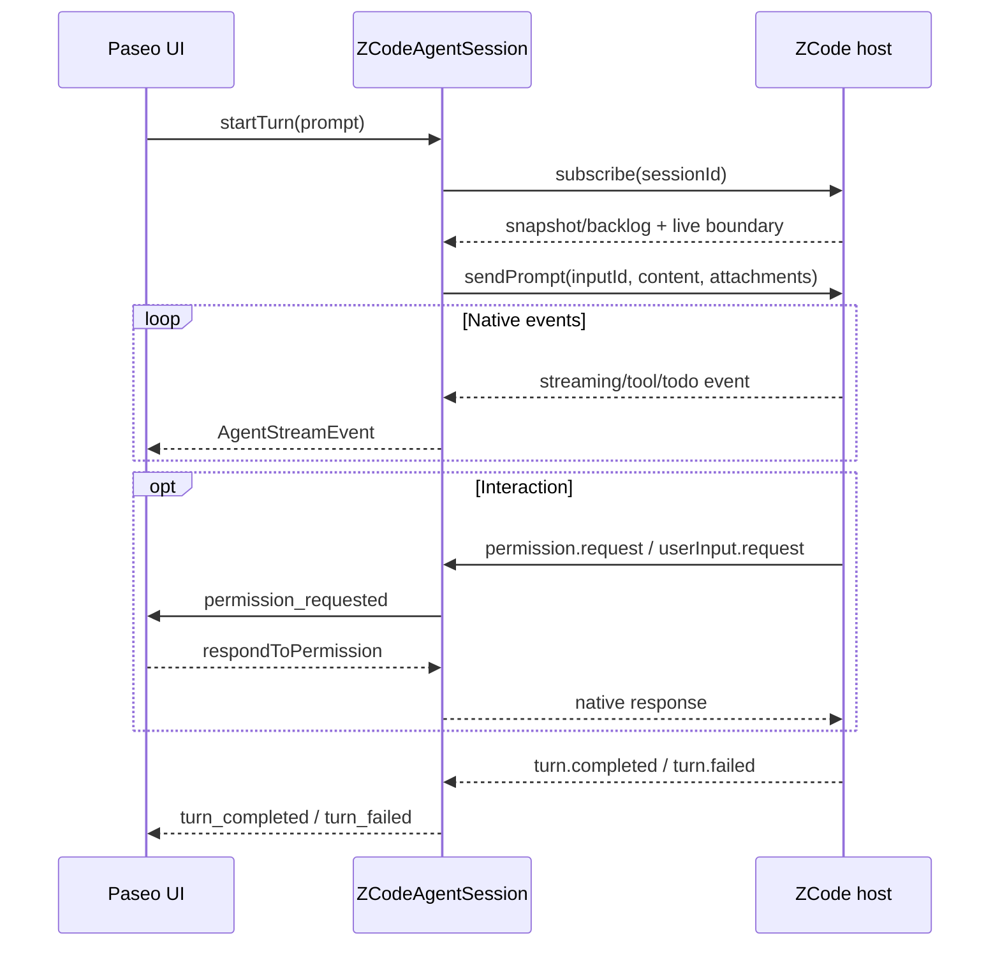
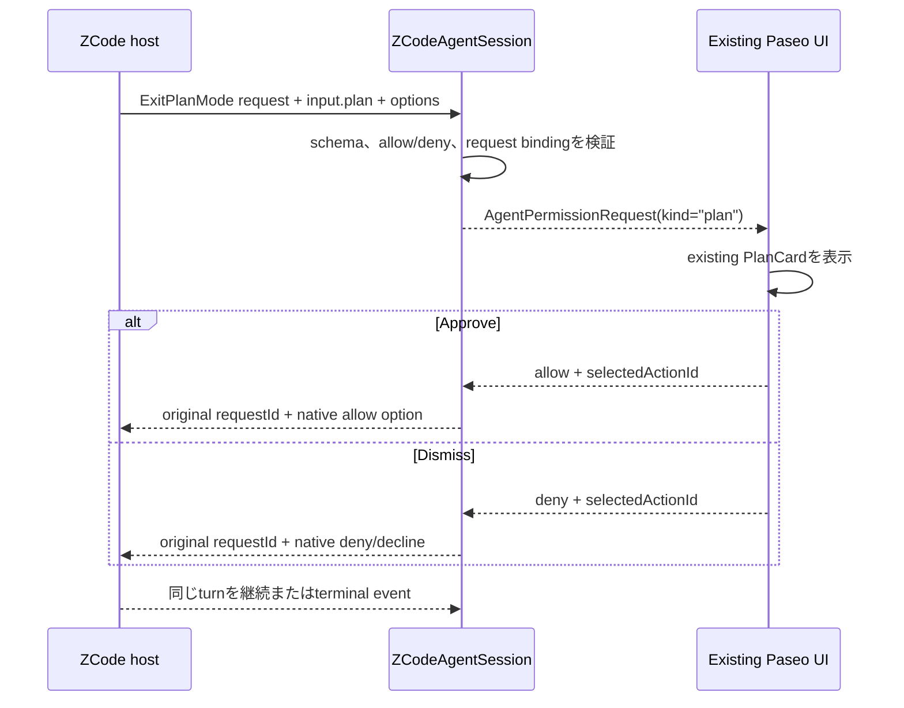

# アーキテクチャ

最終更新: 2026-09-05

## 1. 全体構成



`paseo-zcode-patcher`はbuild時にPaseo sourceへZCode provider実装を追加し、生成物だけをASAR overlayとして保持する。実行時にはPaseo daemon内のproviderがZCode同梱Electronをchild processとして起動する。外部`zcode-acp` processやACP wire protocolは存在しない。

## 2. Componentと責務

### 2.1 Patcher CLI

- platform、Node、元Paseo、ZCode compatibility、停止process、空き容量を事前検証する。
- version固定overlayを一時アプリコピーへ適用する。
- bundle同一性、ASAR、xattr、署名を検証して固定出力へ配置する。
- Paseo/ZCodeの設定、credential、install artifactを変更しない。

### 2.2 `ZCodeAgentClient`

- provider ID、capability、availability、diagnosticを公開する。
- workspace scopeでmodel、thinking option、mode catalogを取得する。
- create/resume/importに必要な`ZCodeAgentSession`を生成する。
- 一つの検証済みhost bridgeを共有し、daemon shutdown時に閉じる。

### 2.3 `ZCodeAgentSession`

- Paseoの`AgentSession`契約を実装する。
- native session ID、canonical workspace、最新snapshot、active turn、pending interactionを保持する。
- ZCode eventをPaseoのstream/timeline/permission eventへ変換する。
- response、cancel、closeをnative requestへexactly onceで戻す。

### 2.4 Runtime discoveryとcompatibility gate

- `/Applications/ZCode.app`をrealpathで解決する。
- executable、CLI、metadata、`app.asar`、host moduleを同じinstall rootから解決する。
- app/CLI version、metadata semantics、platform、host/RPC hash、required exportsを検証する。
- CLI hash差分は`modified` diagnosticとするが、host contract一致とは分離する。
- system Node、PATH上のCLI、別rootのfileへfallbackしない。

### 2.5 Official host bridge

- ZCode Helperを`ELECTRON_RUN_AS_NODE=1`で起動する。
- `worker_threads.Worker`で公式host indexを読み込む。
- utility-processの`process.parentPort` shapeをNode `MessagePort`へ適合する。
- allowlist済みmethodとsubscriptionだけを内部NDJSONへ公開する。
- official hostのstdout/stderrをPaseoの通信経路から分離する。
- headlessで利用できないbrowser requestへ`backend_unavailable`を即時に返す。

### 2.6 Protocol client

- request ID採番、pending map、method別timeout、single writer queueを持つ。
- response、error、event、subscriptionをschema validationする。
- malformed frame、duplicate ID、未知methodでbridgeを閉じる。
- timeout後のlate responseを別requestへ再利用しない。

### 2.7 Session coordinatorとmapper

- workspace/session/turnの状態を一か所で管理する。
- `subscribe -> sendPrompt -> stream -> terminal`の順序を保証する。
- native option ID、質問value、plan source requestをpending stateへ保持する。
- credential、provider header、任意environment値をPaseo eventへ写さない。

## 3. 依存方向

```text
provider-registry
  └─ zcode-agent-client
       ├─ zcode-agent-session
       │    ├─ session-coordinator
       │    └─ event-mapper
       └─ zcode-runtime
            ├─ host-bridge
            ├─ private-protocol schemas
            └─ runtime-discovery + compatibility manifest
```

private protocol層はPaseo型へ依存させない。event mapperだけがnative schemaとPaseo `AgentStreamEvent` / `AgentPermissionRequest`の両方を知る。`zcode-acp`のBun固有APIは移植せず、Paseo serverのNode.js runtimeに合わせて`node:fs/promises`、`node:child_process`、`node:crypto`、Web StreamsまたはNode streamsで実装する。

## 4. State model

### 4.1 Bridge

```text
absent -> starting -> ready -> closing -> absent
                    \-> failed
```

`failed` bridgeへactive turnを再送しない。次の明示操作で再生成する場合も、native session resumeとsubscription確立が成功してからreadyとする。

### 4.2 Session

```text
creating -> idle -> subscribing -> running -> completing -> idle
             |                       |
             |                       +-> awaiting_permission
             |                       +-> awaiting_question
             |                       +-> awaiting_plan_approval
             +-> closing -> closed
```

同一sessionのsecond promptはqueueせず`SESSION_BUSY`相当で拒否する。pending interaction中もturnはactiveのままとする。

### 4.3 Interaction

```text
received -> published -> resolved
                     \-> cancelled
                     \-> failed
```

各native `requestId`は一つのPaseo permission IDと一つのhandlerに対応する。terminal stateへ入ったIDへの二重応答は拒否する。

## 5. Prompt sequence



## 6. Plan sequence



Paseo側でplan IDを生成したり、別のplan updateと承認要求を相関したりしない。必要な情報は一つのnative requestから取得する。

## 7. Process lifecycle

- availability/catalog取得時は検証に必要な短命processだけを使い、必ずabort signalへ従う。
- session作成時にbridgeをlazy startする。
- bridgeはdaemon内で共有してもよいが、sessionとworkspaceのbindingは分離する。
- `AgentSession.close()`はactive turnをcancelし、pending interactionをdeny/cancelしてsubscriptionを破棄する。
- `AgentClient.shutdown()`は新規処理を拒否し、全session、subscription、stdin、child processを順に閉じる。
- graceful timeout後だけprocess treeを終了する。

## 8. Error boundary

次はprovider unavailableまたはsession操作エラーとして扱う。

- ZCode未install、unsupported version/hash/export
- credentialまたはmodel provider未設定
- workspace不一致
- schema validation failure
- child unexpected exit、request timeout、sequence duplicate/regression
- browser backend以外のunsupported reverse request

次を行ってはならない。

- errorを空assistant messageや正常な`turn_completed`へ丸める
- active promptを自動再送する
- option labelから権限の意味を推測する
- 未知eventをsilent dropする
- 別runtime、別module、別versionへfallbackする
