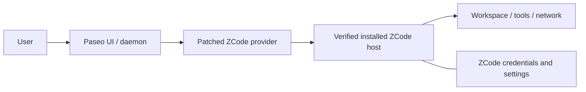

# Security and licensing

最終更新: 2026-09-06

## 1. Trust boundary

- renderer/daemon input、workspace内容、model output、native eventを無条件に信用しない。
- ZCode hostは同一machineのchildでもschema validation対象とする。
- tool permissionはmodel outputではなく利用者の選択からだけ決定する。
- patcher/providerはcredential storeの所有者にならない。

## 2. Permission invariants

- native optionを自動承認しない。
- labelからallow/deny、once/alwaysを再推測しない。
- `selectedActionId`をoriginal requestのoption mapで検証する。
- unknown/stale option、disconnect、timeout、cancel、shutdownではallowを返さない。
- `yolo`を暗黙に選択しない。
- cancel後のlate allow responseを適用しない。
- session、turn、request IDをbindingし、responseをexactly onceにする。
- plan approvalを通常tool permissionやtodoへ偽装しない。

## 3. Credentialとprovider headers

credentialの作成、refresh、保存、provider registry、通常runtime headerはZCode公式runtimeの責務とする。provider/patcherはcredential file formatを複製しない。

次をlog、diagnostic、Paseo metadata、manifest、test fixture、release artifactへ含めない。

- access/refresh token、OAuth cookie、authorization code
- API key、provider runtime header
- environment値、ZCode user config全体
- prompt、assistant response、tool input/outputの全文
- home directoryを含む不要なabsolute path

interactive provider header recoveryは値を要求せず`headersApplied: false`で失敗させる。error messageはsanitizationしてからPaseoへ渡す。

## 4. Process and path safety

- shellを介さずexecutable/args配列でspawnする。
- executable、CLI、metadata、host moduleを同じverified install rootから解決する。
- realpath後にinstall root外へ出るpathを拒否する。
- workspaceは既存absolute directoryとしてcanonicalizeし、sessionへbindingする。
- arbitrary command/module overrideを設定surfaceへ公開しない。
- child stdout/stderr、Paseo protocol、structured logを分離する。
- shutdownはgraceful close後、timeoutした既知child process treeだけを終了する。

## 5. Protocol hardening

- Zodなどのruntime schemaで全result/event/reverse requestを検証する。
- frame size、pending request数、event backlogへ上限を設ける。
- duplicate ID、sequenceの重複・逆行、unknown event、invalid transitionを拒否する。delivery kindによるfilterで欠番は発生するため、増加方向のgap自体は拒否しない。
- operation semanticsに応じたtimeoutを設け、一律短時間timeoutでmodel turnを切らない。
- response writerを一つのqueueへ直列化する。
- active turnをchild再起動後に再送しない。

## 6. Logging

既定ではPaseoの既存loggerへ構造化されたcategory、operation、duration、error code、伏字済みIDだけを送る。provider独自の永続log fileやdebug payload loggingは初版で追加しない。

ログに含めてよい値:

- timestamp、severity、provider/patcher version
- Paseo/ZCode version、artifact/protocol ID
- method/event type、duration、exit code、error category
- request/session IDのhashまたは短い相関ID

raw objectをそのままloggerへ渡さない。redactionに失敗したerrorはgeneric messageとcorrelation IDへ置き換える。

## 7. Patch safety

- 元PaseoとZCodeを読み取り専用入力として扱う。
- 対象version/hash、overlay、entry、生成ASARをmanifestで検証する。
- fixed output以外を削除しない。
- symlink targetをたどって削除しない。
- 一時bundleだけを変更・署名し、成功後にatomic renameする。
- 失敗時に不完全な出力を残さず、元入力の不変を再確認する。

## 8. Privacy

ZCode runtimeがmodel/providerへ送るprompt、workspace情報、telemetryはZCodeのprivacy policyとtermsに従う。patcherはそのnetwork behaviorを変更・代理しない。Paseo側の履歴保存とログも別のdata ownerであることを利用者向けREADMEへ明記する。

## 9. Licensing and distribution

- Gitでソースコードのみを配布し、生成済みCLI、overlay、npm package、アプリ本体は配布しない。PaseoとZCodeのbinary、ASAR、host moduleを含めない。
- 利用者のPCで公式Paseoの固定source archiveを取得し、SHA-256を照合してから展開・buildする。生成manifestはGit管理の検証値と照合する。
- 利用者が公式配布物を別途installし、patcherはlocal copyの生成とlocal runtime起動だけを行う。
- `zcode-acp`からcodeを利用する場合は、そのlicense/notice条件を実装時の参照commitで確認し、必要なnoticeを保持する。
- `paseo-acp-patcher`からcodeを利用する場合も同様にlicense/noticeを確認する。
- ZCode/Paseoのlogoやtrademark assetを独自packageへ同梱しない。
- dependency lock、license一覧、checksumはソース更新時に確認する。PaseoのApache-2.0と第三者コードの個別license、およびソースパッチの著作権表示・変更表示は保持する。

この文書は法的助言ではない。ソース配布にもlicense条件は適用される。参照repositoryの配布権限は、生成物を配布しないことや`private: true`だけでは確定しない。

## 10. Security acceptance checklist

- [x] allow/deny/cancel/double-responseの自動test
- [x] plan approvalのsource/request/option binding test
- [x] secret fixtureによるlog/artifact検査
- [x] oversized/malformed frame、pending request上限、event backlog上限のtest
- [x] path traversal/symlink/workspace binding test
- [x] child process cleanup testと実機終了後のprocess確認
- [x] unsupported Paseo/ZCode fail-closed test
- [x] 元アプリ不変とpatched appのstrict署名検証
- [x] Gitの配布対象に生成済みoverlay・CLI・Paseo/ZCodeアプリ本体を含めない
- [ ] 参照repositoryのソース配布権限と必要なnoticeの確認。npmへの誤公開防止のためpackageはprivate
